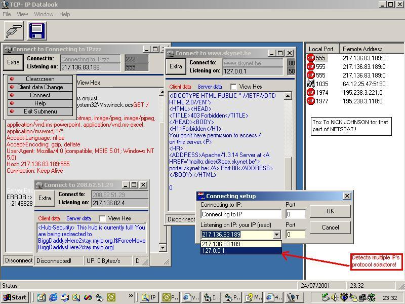



## TCP\-IP Datalook V1\.4 UPDATED\!\!  \*\* Support multiple protocol adaptors \*\* \(07\-24\-01\)

### Description

UPDATED!!(07-24-2001) 

Support now Multiple IP,protocol adaptors ! 

Check,look the data on TCP-IP sockets.

Now with 'Extra' , that shows a option menu per Connection you make.(clearscreen - Data change for Client appl - Connect/Disconnect button - Help box)  

PROGRAM DESCRIPTION::::  

----

 

View the data on a socket between Client application & Server application. 

(With this program you can use multiple connections-sockets) 

So with this program you can see (visual) the data between example outlook & ISP-pop3 server.

You can also save the data for further study. 

If you have example a internet application,

Direct Connect,mirc..ect, let this client appl connect to my program & let my program connect the needed server, so now you have the possibility to view the data between server & client.. so you can study it & make maybe a own clone application that uses the protocol , data you've captured..   

HOW IT WORKS:  

----

 

Let a client appl not connect to the server, but to the local ip & port of your pc.. 

Now click on the new connection button, 

& lets listen on the port where the client appl will connect to..(fill down the port!) 

Put in the box connecting to the dns or ip & port where my appl will connect to (in that case the ip & port of the server). 

So you have now the possibility to view the data between server & client.. 

You can also save the captured data to DISK ! 

(And you can it open later...) 

Try the program & test the new options !  

With this application , you also can see the local used ports & where they are connected to..

(that part of code i've borrowed here..)  

Have fun ! and view now the protocols that you doesn't know yet....  

PS: Please Vote for me !  

.... See my other stuff on PSC.. 

----

 

To Nick Johnson for the NETSTAT part ! see on right part of the screenshot .

----

  

Greetings, 

Peter.
 
### More Info
 
uses Inet & winsock control.

and a few api calls.

             |
---                |---
**Submitted On**   |2001-07-24 23:46:02
**By**             |[Peter V\.](https://github.com/Planet-Source-Code/PSCIndex/blob/master/ByAuthor/peter-v.md)
**Level**          |Intermediate
**User Rating**    |5.0 (199 globes from 40 users)
**Compatibility**  |VB 4\.0 \(32\-bit\), VB 5\.0, VB 6\.0
**Category**       |[Complete Applications](https://github.com/Planet-Source-Code/PSCIndex/blob/master/ByCategory/complete-applications__1-27.md)
**World**          |[Visual Basic](https://github.com/Planet-Source-Code/PSCIndex/blob/master/ByWorld/visual-basic.md)
**Archive File**   |[TCP\-IP Dat234337242001\.zip](https://github.com/Planet-Source-Code/peter-v-tcp-ip-datalook-v1-4-updated-support-multiple-protocol-adaptors-07-24-01__1-25071/archive/master.zip)

